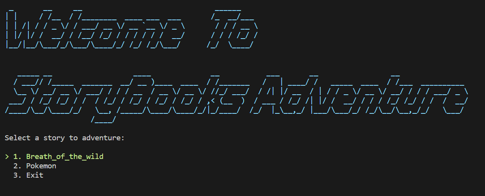

## Chen_Zhang_T1A3

T1A3 Terminal Application

# Storybooks Adveture

### R4 - Source control repository:

[git@github.com:OrangeKami/Chen_Zhang_T1A3.git]

(https://github.com/OrangeKami/Chen_Zhang_T1A3.git)

### Instalation

Install gem and bundle
   bundle install

To run the app
    ruby ./main.rb

### Dependencies

#### Gems 
    - artii
    - colorize
    - csv
    - terminal-table
    - tty-prompt
    - rspec
  
## R6-Features

    1. #### Can automatically import the name of the books when you create the books under the Stories menu with its own folder.

 The code is below:
   
        @prompt = TTY::Prompt.new
        choose = @prompt.select("Select a story to adventure:\n") do |menu|
        menu.enum '.'
        Dir.glob("./Stories/*/*.rb").each do |book_rb|  
            choose = File.basename(book_rb, ".rb")
            menu.choice choose   
        end
        menu.choice "Exit"
        end

2. ### Use .sample() get a random value of a Array.
   
   It can shows differet every time you use it. 

     
        #pokemon database
        poke_name = ["Pikachu", "Charmander", "Squirtle", "Bulbsaur", "Diglett", "Abra", "Ponyta", "Magikarp", "Eevee", "Mewtwo"]
        
        gender = ["Female", "Male", 'Uni-sex']
        
        location = ["Route1", "Route2", "Route13", "Route15", "Route28", "Berry_Forest", "Four_island", "Lost_cave", "Tanoby Ruins"]

        
    
        start = Pokemon_adv.new(poke_name.sample(3), gender.sample(3), location.sample(3))
        pokemon_array << start
        
        
        
         i = 3
        loop do 
            line_break
            chat "You are walking at " + "#{start.location[0]}.".blue
            line_break_space
            chat "Sunddenly, a wild #{start.gender[0]} " + "#{start.poke_name[0]} ".cyan + "shows up!"
            line_break_space
            chat "It seems harmless~"
            line_break_space
            chat "Do you want to catch " + "#{start.poke_name[0]}".cyan + "? Y/N"
           
               i -= 1 

3. ### Read, Write and delete lines from CSV file.
   
    As Shown as picture below

As you seen at screen shot you can delete the pokemon and add description of pokemon as well

4. ### DRY

Set a layout.rb file to store the page layout like line_break, color, and end_of_story, "thank you" logo etc. 

## Implementation

I use trello to trank my implementation plan.

### My books
#### Breath of wild

Breath of the Wild is srtoy based adventure, every choice made by you will leading to a different ending.
#### Pokemon

Pokemon is a simpilify Real pokemon game, that you can catch the pokemon you want, and add Description of the pokmon by yourself.

### Code Style
The code for this application is written in the following code style using Rubocop.

    -rubocop GitHub

    -rubocop Documentation
    
    -Ruby Style Guide

